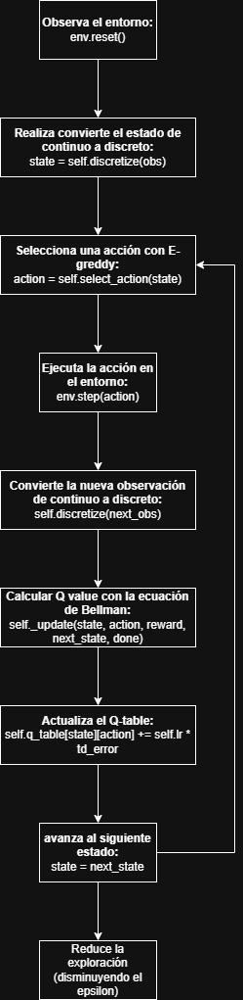
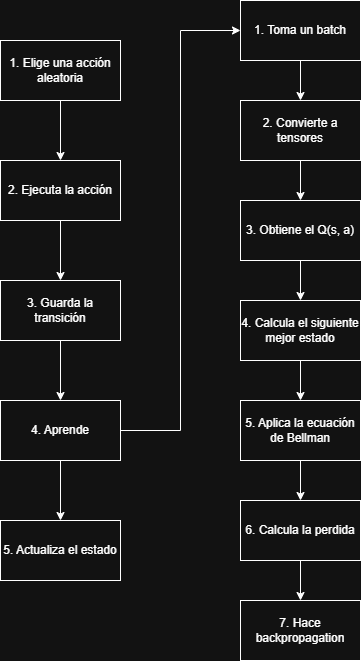

A hands-on repo for understanding how Reinforcement Learning works.
Train, inspect, and visualise RL agents on [LunarLander-v3](https://gymnasium.farama.org/environments/box2d/lunar_lander/) (or any other Gymnasium environment).

## LunarLander-v3 environment

The default environment is [LunarLander-v3](https://gymnasium.farama.org/environments/box2d/lunar_lander/).
The lander starts at the top of the screen and the goal is to land it softly on the landing pad (between the two flags) using thrust and rotation.

### State (observation) — 8 continuous values

| Index | Variable | Description | Range |
|:---:|---|---|---|
| 0 | x | Horizontal position | -2.5 to 2.5 |
| 1 | y | Vertical position | -2.5 to 2.5 |
| 2 | vx | Horizontal velocity | -10 to 10 |
| 3 | vy | Vertical velocity | -10 to 10 |
| 4 | angle | Angle of the lander (radians) | -6.28 to 6.28 |
| 5 | angular velocity | Rotation speed | -10 to 10 |
| 6 | left leg contact | 1 if left leg touches ground, 0 otherwise | 0 or 1 |
| 7 | right leg contact | 1 if right leg touches ground, 0 otherwise | 0 or 1 |

### Actions — 4 discrete

| Value | Action |
|:---:|---|
| 0 | Do nothing |
| 1 | Fire left orientation engine (rotate right) |
| 2 | Fire main engine (thrust up) |
| 3 | Fire right orientation engine (rotate left) |

### Rewards

| Event | Reward |
|---|---|
| Moving towards the landing pad | positive, proportional to distance reduction |
| Moving away from the landing pad | negative |
| Crash | **-100** |
| Successful landing (come to rest) | **+100** |
| Each leg ground contact | **+10** |
| Firing main engine (per frame) | **-0.3** |
| Firing side engine (per frame) | **-0.03** |

An episode is considered **solved** at **+200** points average over 100 episodes.
The episode ends when the lander crashes, lands, or after **1000 time steps** (truncation).

> Run `rlgames inspect` to see live state/action/reward values from the environment.

## Quick concepts — Q-Learning methods

### The core idea

An RL agent interacts with an **environment** in discrete time steps.
At each step it observes a **state** $s$, picks an **action** $a$, receives a **reward** $r$, and transitions to a new state $s'$.
The goal is to learn a **policy** $\pi(s) \to a$ that maximises the total (discounted) reward over time.

### Q-values and the Bellman equation

A **Q-value** $Q(s, a)$ estimates the expected cumulative reward of taking action $a$ in state $s$ and then following the optimal policy.
The optimal Q-values satisfy the **Bellman optimality equation**:

$$
Q^{*}(s, a) = r + \gamma \max_{a'} Q^{*}(s', a')
$$

where $\gamma \in [0, 1]$ is the **discount factor** (how much the agent cares about future vs. immediate rewards).

### Tabular Q-Learning

When the state and action spaces are small (or can be discretized), we store Q-values in a table and update them after every transition:

$$
Q(s, a) \leftarrow Q(s, a) + \alpha \bigl[ r + \gamma \max_{a'} Q(s', a') - Q(s, a) \bigr]
$$

- $\alpha$ (learning rate) — how fast we update.
- **$\varepsilon$-greedy** exploration — with probability $\varepsilon$ pick a random action, otherwise pick $\arg\max_a Q(s, a)$. $\varepsilon$ decays over time so the agent gradually shifts from exploring to exploiting.

> See `src/rl_games/agents/qlearning.py` for a complete tabular implementation.

### Deep Q-Network (DQN)

When the state space is continuous (like the 8-dimensional LunarLander observation), a table no longer works.
**DQN** replaces the table with a neural network $Q_\theta(s, a)$ and introduces two key tricks:

| Trick | Why |
|---|---|
| **Experience replay** | Store transitions in a buffer, sample random mini-batches — breaks correlation between consecutive samples and reuses data. |
| **Target network** | Keep a frozen copy of the Q-network and update it periodically — stabilises the moving Bellman target. |

Training step (one gradient update):

1. Sample a mini-batch $\{(s, a, r, s', \text{done})\}$ from the replay buffer.
2. Compute targets: $y = r + \gamma \cdot \max_{a'} Q_{\text{target}}(s', a') \cdot (1 - \text{done})$.
3. Minimise MSE between $Q_\theta(s, a)$ and $y$.

> See `src/rl_games/agents/dqn.py` for a from-scratch PyTorch implementation where every component (network, replay buffer, training loop) is visible and editable.

### Exploration vs. Exploitation

This is the fundamental trade-off in RL.
**Explore** (random actions) to discover new, potentially better strategies.
**Exploit** (greedy actions) to collect the highest reward based on current knowledge.
The $\varepsilon$-greedy schedule balances both: start with high $\varepsilon$ (mostly exploring) and anneal towards low $\varepsilon$ (mostly exploiting).

## Agents

| Agent | Algorithm | State representation | File |
|---|---|---|---|
| `qlearning` | Tabular Q-Learning | Discretized (8 bins per dim) | `agents/qlearning.py` |
| `dqn` | DQN from scratch (PyTorch) | Raw continuous | `agents/dqn.py` |

## Setup

```bash
uv sync
source .venv/bin/activate   # Linux / macOS
.venv\Scripts\activate      # Windows
```

## CLI usage

```bash
rlgames <command> [agent] [options]
```

### Version

```bash
rlgames version
```

### List agents and their save status

```bash
rlgames list
```

### Inspect an environment

Show state/action spaces and sample a few random transitions to see what the agent observes.

```bash
rlgames inspect                          # LunarLander-v3 (default)
rlgames inspect --steps 10              # more sample transitions
```

### Initialize a new untrained agent

```bash
rlgames init qlearning
rlgames init dqn
```

### Train an agent

Creates a save if none exists, resumes from an existing save otherwise.

```bash
rlgames train qlearning --episodes 20000
rlgames train dqn       --episodes 500
```

### Load a save and display info

```bash
rlgames load qlearning
rlgames load dqn --eval
```

### Simulate episodes (text output)

Run a trained agent and see every action, reward, and outcome in the terminal.

```bash
rlgames sim qlearning --episodes 3              # full episodes
rlgames sim dqn       --episodes 2 --verbose    # full episodes with state vectors
rlgames sim dqn       --episodes 5 --steps 10   # only first 10 steps per episode
```

### Render episodes (graphical window)

```bash
rlgames render qlearning --episodes 3
rlgames render dqn       --episodes 3
```

### Delete a saved agent

```bash
rlgames delete qlearning
rlgames delete dqn
```

## Project structure

```
src/rl_games/
├── cli.py                  # CLI entry point
└── agents/
    ├── qlearning.py        # Tabular Q-Learning agent
    └── dqn.py              # DQN agent from scratch (PyTorch)
```

Saves are written to `saves/` in the working directory.

## Training results

### Q learning

Resultados del entrenamiento

```
Episode 100/10000 | Avg Reward: -161.82 | Epsilon: 0.8869 | States visited: 150
Episode 200/10000 | Avg Reward: -143.81 | Epsilon: 0.7865 | States visited: 204
Episode 300/10000 | Avg Reward: -131.05 | Epsilon: 0.6975 | States visited: 233
Episode 400/10000 | Avg Reward: -93.02 | Epsilon: 0.6186 | States visited: 338
Episode 500/10000 | Avg Reward: -107.30 | Epsilon: 0.5486 | States visited: 382
Episode 600/10000 | Avg Reward: -92.48 | Epsilon: 0.4865 | States visited: 443
Episode 700/10000 | Avg Reward: -112.56 | Epsilon: 0.4315 | States visited: 490
Episode 800/10000 | Avg Reward: -94.53 | Epsilon: 0.3827 | States visited: 513
Episode 900/10000 | Avg Reward: -119.31 | Epsilon: 0.3394 | States visited: 531
Episode 1000/10000 | Avg Reward: -123.27 | Epsilon: 0.3010 | States visited: 540
Episode 1100/10000 | Avg Reward: -141.72 | Epsilon: 0.2669 | States visited: 547
Episode 1200/10000 | Avg Reward: -145.65 | Epsilon: 0.2367 | States visited: 566
Episode 1300/10000 | Avg Reward: -151.44 | Epsilon: 0.2099 | States visited: 578
Episode 1400/10000 | Avg Reward: -140.35 | Epsilon: 0.1862 | States visited: 585
Episode 1500/10000 | Avg Reward: -175.82 | Epsilon: 0.1651 | States visited: 598
Episode 1600/10000 | Avg Reward: -169.44 | Epsilon: 0.1464 | States visited: 601
Episode 1700/10000 | Avg Reward: -162.15 | Epsilon: 0.1299 | States visited: 621
Episode 1800/10000 | Avg Reward: -160.70 | Epsilon: 0.1152 | States visited: 633
Episode 1900/10000 | Avg Reward: -138.21 | Epsilon: 0.1021 | States visited: 638
Episode 2000/10000 | Avg Reward: -132.81 | Epsilon: 0.0906 | States visited: 641
...
Episode 4000/10000 | Avg Reward: -71.17 | Epsilon: 0.0100 | States visited: 763
Episode 4100/10000 | Avg Reward: -62.56 | Epsilon: 0.0100 | States visited: 763
Episode 4200/10000 | Avg Reward: -69.06 | Epsilon: 0.0100 | States visited: 763
Episode 4300/10000 | Avg Reward: -87.55 | Epsilon: 0.0100 | States visited: 764
Episode 4400/10000 | Avg Reward: -85.92 | Epsilon: 0.0100 | States visited: 766
Episode 4500/10000 | Avg Reward: -86.64 | Epsilon: 0.0100 | States visited: 769
Episode 4600/10000 | Avg Reward: -100.91 | Epsilon: 0.0100 | States visited: 776
Episode 4700/10000 | Avg Reward: -103.01 | Epsilon: 0.0100 | States visited: 778
Episode 4800/10000 | Avg Reward: -89.48 | Epsilon: 0.0100 | States visited: 779
Episode 4900/10000 | Avg Reward: -106.77 | Epsilon: 0.0100 | States visited: 781
Episode 5000/10000 | Avg Reward: -78.70 | Epsilon: 0.0100 | States visited: 781
Episode 5100/10000 | Avg Reward: -88.98 | Epsilon: 0.0100 | States visited: 781
Episode 5200/10000 | Avg Reward: -96.11 | Epsilon: 0.0100 | States visited: 781
Episode 5300/10000 | Avg Reward: -84.26 | Epsilon: 0.0100 | States visited: 781
Episode 5400/10000 | Avg Reward: -108.98 | Epsilon: 0.0100 | States visited: 781
Episode 5500/10000 | Avg Reward: -108.19 | Epsilon: 0.0100 | States visited: 781
Episode 5600/10000 | Avg Reward: -101.49 | Epsilon: 0.0100 | States visited: 783
Episode 5700/10000 | Avg Reward: -159.00 | Epsilon: 0.0100 | States visited: 785
Episode 5800/10000 | Avg Reward: -136.23 | Epsilon: 0.0100 | States visited: 785
Episode 5900/10000 | Avg Reward: -140.33 | Epsilon: 0.0100 | States visited: 794
Episode 6000/10000 | Avg Reward: -132.06 | Epsilon: 0.0100 | States visited: 797
...
Episode 8000/10000 | Avg Reward: -64.11 | Epsilon: 0.0100 | States visited: 845
Episode 8100/10000 | Avg Reward: -79.36 | Epsilon: 0.0100 | States visited: 846
Episode 8200/10000 | Avg Reward: -60.73 | Epsilon: 0.0100 | States visited: 846
Episode 8300/10000 | Avg Reward: -40.28 | Epsilon: 0.0100 | States visited: 849
Episode 8400/10000 | Avg Reward: -55.53 | Epsilon: 0.0100 | States visited: 851
Episode 8500/10000 | Avg Reward: -57.12 | Epsilon: 0.0100 | States visited: 851
Episode 8600/10000 | Avg Reward: -72.98 | Epsilon: 0.0100 | States visited: 851
Episode 8700/10000 | Avg Reward: -60.70 | Epsilon: 0.0100 | States visited: 852
Episode 8800/10000 | Avg Reward: -53.81 | Epsilon: 0.0100 | States visited: 854
Episode 8900/10000 | Avg Reward: -63.60 | Epsilon: 0.0100 | States visited: 857
Episode 9000/10000 | Avg Reward: -66.27 | Epsilon: 0.0100 | States visited: 857
Episode 9100/10000 | Avg Reward: -59.82 | Epsilon: 0.0100 | States visited: 859
Episode 9200/10000 | Avg Reward: -35.33 | Epsilon: 0.0100 | States visited: 859
Episode 9300/10000 | Avg Reward: -45.43 | Epsilon: 0.0100 | States visited: 865
Episode 9400/10000 | Avg Reward: -52.34 | Epsilon: 0.0100 | States visited: 865
Episode 9500/10000 | Avg Reward: -66.50 | Epsilon: 0.0100 | States visited: 865
Episode 9600/10000 | Avg Reward: -42.19 | Epsilon: 0.0100 | States visited: 865
Episode 9700/10000 | Avg Reward: -51.12 | Epsilon: 0.0100 | States visited: 866
Episode 9800/10000 | Avg Reward: -38.95 | Epsilon: 0.0100 | States visited: 866
Episode 9900/10000 | Avg Reward: -34.78 | Epsilon: 0.0100 | States visited: 866
Episode 10000/10000 | Avg Reward: -83.03 | Epsilon: 0.0100 | States visited: 866
```

Flujo de Q learning



Simulacion de resultado

<video src="img/simulation_qlearning.mp4" controls width="600"></video>

### DNQ

Resultados del entrenamiento

```
Episode 10/1000 | Avg Reward: -240.00 | Epsilon: 0.9511 | Buffer: 1015
Episode 20/1000 | Avg Reward: -136.57 | Epsilon: 0.9046 | Buffer: 1931
Episode 30/1000 | Avg Reward: -137.91 | Epsilon: 0.8604 | Buffer: 2884
Episode 40/1000 | Avg Reward: -158.13 | Epsilon: 0.8183 | Buffer: 4067
Episode 50/1000 | Avg Reward: -122.35 | Epsilon: 0.7783 | Buffer: 5082
Episode 60/1000 | Avg Reward: -134.88 | Epsilon: 0.7403 | Buffer: 6257
Episode 70/1000 | Avg Reward: -126.94 | Epsilon: 0.7041 | Buffer: 7434
Episode 80/1000 | Avg Reward: -105.85 | Epsilon: 0.6696 | Buffer: 8739
Episode 90/1000 | Avg Reward: -87.13 | Epsilon: 0.6369 | Buffer: 10035
Episode 100/1000 | Avg Reward: -95.20 | Epsilon: 0.6058 | Buffer: 11556
Episode 110/1000 | Avg Reward: -75.14 | Epsilon: 0.5762 | Buffer: 13168
Episode 120/1000 | Avg Reward: -54.66 | Epsilon: 0.5480 | Buffer: 14537
Episode 130/1000 | Avg Reward: -86.59 | Epsilon: 0.5212 | Buffer: 16220
Episode 140/1000 | Avg Reward: -63.76 | Epsilon: 0.4957 | Buffer: 18886
Episode 150/1000 | Avg Reward: -72.50 | Epsilon: 0.4715 | Buffer: 23265
Episode 160/1000 | Avg Reward: -19.50 | Epsilon: 0.4484 | Buffer: 24964
Episode 170/1000 | Avg Reward: -57.23 | Epsilon: 0.4265 | Buffer: 27375
Episode 180/1000 | Avg Reward: -72.64 | Epsilon: 0.4057 | Buffer: 34345
Episode 190/1000 | Avg Reward: -35.36 | Epsilon: 0.3858 | Buffer: 41716
Episode 200/1000 | Avg Reward: -88.76 | Epsilon: 0.3670 | Buffer: 48382
Episode 210/1000 | Avg Reward: -43.71 | Epsilon: 0.3490 | Buffer: 57275
Episode 220/1000 | Avg Reward: -40.77 | Epsilon: 0.3320 | Buffer: 67275
Episode 230/1000 | Avg Reward: -51.80 | Epsilon: 0.3157 | Buffer: 76417
Episode 240/1000 | Avg Reward: -94.46 | Epsilon: 0.3003 | Buffer: 82864
Episode 250/1000 | Avg Reward: -42.82 | Epsilon: 0.2856 | Buffer: 92864
Episode 260/1000 | Avg Reward: -87.70 | Epsilon: 0.2716 | Buffer: 100000
Episode 270/1000 | Avg Reward: -65.06 | Epsilon: 0.2584 | Buffer: 100000
Episode 280/1000 | Avg Reward: -81.77 | Epsilon: 0.2457 | Buffer: 100000
Episode 290/1000 | Avg Reward: -67.54 | Epsilon: 0.2337 | Buffer: 100000
Episode 300/1000 | Avg Reward: -74.98 | Epsilon: 0.2223 | Buffer: 100000
Episode 310/1000 | Avg Reward: -1.55 | Epsilon: 0.2114 | Buffer: 100000
Episode 320/1000 | Avg Reward: -22.86 | Epsilon: 0.2011 | Buffer: 100000
Episode 330/1000 | Avg Reward: 3.10 | Epsilon: 0.1913 | Buffer: 100000
Episode 340/1000 | Avg Reward: 13.72 | Epsilon: 0.1819 | Buffer: 100000
Episode 350/1000 | Avg Reward: 4.45 | Epsilon: 0.1730 | Buffer: 100000
Episode 360/1000 | Avg Reward: 67.86 | Epsilon: 0.1646 | Buffer: 100000
Episode 370/1000 | Avg Reward: 55.69 | Epsilon: 0.1565 | Buffer: 100000
Episode 380/1000 | Avg Reward: 42.56 | Epsilon: 0.1489 | Buffer: 100000
Episode 390/1000 | Avg Reward: 16.08 | Epsilon: 0.1416 | Buffer: 100000
Episode 400/1000 | Avg Reward: 67.36 | Epsilon: 0.1347 | Buffer: 100000
Episode 410/1000 | Avg Reward: 42.26 | Epsilon: 0.1281 | Buffer: 100000
Episode 420/1000 | Avg Reward: 44.39 | Epsilon: 0.1218 | Buffer: 100000
Episode 430/1000 | Avg Reward: 83.81 | Epsilon: 0.1159 | Buffer: 100000
Episode 440/1000 | Avg Reward: 42.98 | Epsilon: 0.1102 | Buffer: 100000
Episode 450/1000 | Avg Reward: 110.38 | Epsilon: 0.1048 | Buffer: 100000
Episode 460/1000 | Avg Reward: 58.94 | Epsilon: 0.0997 | Buffer: 100000
Episode 470/1000 | Avg Reward: -19.04 | Epsilon: 0.0948 | Buffer: 100000
Episode 480/1000 | Avg Reward: -14.98 | Epsilon: 0.0902 | Buffer: 100000
Episode 490/1000 | Avg Reward: 74.56 | Epsilon: 0.0858 | Buffer: 100000
Episode 500/1000 | Avg Reward: 52.67 | Epsilon: 0.0816 | Buffer: 100000
Episode 510/1000 | Avg Reward: 150.56 | Epsilon: 0.0776 | Buffer: 100000
Episode 520/1000 | Avg Reward: 140.86 | Epsilon: 0.0738 | Buffer: 100000
Episode 530/1000 | Avg Reward: 67.73 | Epsilon: 0.0702 | Buffer: 100000
Episode 540/1000 | Avg Reward: 40.08 | Epsilon: 0.0668 | Buffer: 100000
Episode 550/1000 | Avg Reward: -5.03 | Epsilon: 0.0635 | Buffer: 100000
Episode 560/1000 | Avg Reward: 40.17 | Epsilon: 0.0604 | Buffer: 100000
Episode 570/1000 | Avg Reward: 97.93 | Epsilon: 0.0574 | Buffer: 100000
Episode 580/1000 | Avg Reward: 71.52 | Epsilon: 0.0546 | Buffer: 100000
Episode 590/1000 | Avg Reward: 94.14 | Epsilon: 0.0520 | Buffer: 100000
Episode 600/1000 | Avg Reward: 134.60 | Epsilon: 0.0500 | Buffer: 100000
Episode 610/1000 | Avg Reward: 159.19 | Epsilon: 0.0500 | Buffer: 100000
Episode 620/1000 | Avg Reward: 156.71 | Epsilon: 0.0500 | Buffer: 100000
Episode 630/1000 | Avg Reward: 159.63 | Epsilon: 0.0500 | Buffer: 100000
Episode 640/1000 | Avg Reward: 121.08 | Epsilon: 0.0500 | Buffer: 100000
Episode 650/1000 | Avg Reward: 158.03 | Epsilon: 0.0500 | Buffer: 100000
Episode 660/1000 | Avg Reward: 215.96 | Epsilon: 0.0500 | Buffer: 100000
Episode 670/1000 | Avg Reward: 239.57 | Epsilon: 0.0500 | Buffer: 100000
Episode 680/1000 | Avg Reward: 177.57 | Epsilon: 0.0500 | Buffer: 100000
Episode 690/1000 | Avg Reward: 164.96 | Epsilon: 0.0500 | Buffer: 100000
Episode 700/1000 | Avg Reward: 226.65 | Epsilon: 0.0500 | Buffer: 100000
Episode 710/1000 | Avg Reward: 207.83 | Epsilon: 0.0500 | Buffer: 100000
Episode 720/1000 | Avg Reward: 214.88 | Epsilon: 0.0500 | Buffer: 100000
Episode 730/1000 | Avg Reward: 240.57 | Epsilon: 0.0500 | Buffer: 100000
Episode 740/1000 | Avg Reward: 221.11 | Epsilon: 0.0500 | Buffer: 100000
Episode 750/1000 | Avg Reward: 253.93 | Epsilon: 0.0500 | Buffer: 100000
Episode 760/1000 | Avg Reward: 212.64 | Epsilon: 0.0500 | Buffer: 100000
Episode 770/1000 | Avg Reward: 219.04 | Epsilon: 0.0500 | Buffer: 100000
Episode 780/1000 | Avg Reward: 155.46 | Epsilon: 0.0500 | Buffer: 100000
Episode 790/1000 | Avg Reward: 223.66 | Epsilon: 0.0500 | Buffer: 100000
Episode 800/1000 | Avg Reward: 186.82 | Epsilon: 0.0500 | Buffer: 100000
Episode 810/1000 | Avg Reward: 224.08 | Epsilon: 0.0500 | Buffer: 100000
Episode 820/1000 | Avg Reward: 225.67 | Epsilon: 0.0500 | Buffer: 100000
Episode 830/1000 | Avg Reward: 157.07 | Epsilon: 0.0500 | Buffer: 100000
Episode 840/1000 | Avg Reward: 161.56 | Epsilon: 0.0500 | Buffer: 100000
Episode 850/1000 | Avg Reward: 214.79 | Epsilon: 0.0500 | Buffer: 100000
Episode 860/1000 | Avg Reward: 167.49 | Epsilon: 0.0500 | Buffer: 100000
Episode 870/1000 | Avg Reward: 233.97 | Epsilon: 0.0500 | Buffer: 100000
Episode 880/1000 | Avg Reward: 229.11 | Epsilon: 0.0500 | Buffer: 100000
Episode 890/1000 | Avg Reward: 236.43 | Epsilon: 0.0500 | Buffer: 100000
Episode 900/1000 | Avg Reward: 244.40 | Epsilon: 0.0500 | Buffer: 100000
Episode 910/1000 | Avg Reward: 164.45 | Epsilon: 0.0500 | Buffer: 100000
Episode 920/1000 | Avg Reward: 262.37 | Epsilon: 0.0500 | Buffer: 100000
Episode 930/1000 | Avg Reward: 216.44 | Epsilon: 0.0500 | Buffer: 100000
Episode 940/1000 | Avg Reward: 230.19 | Epsilon: 0.0500 | Buffer: 100000
Episode 950/1000 | Avg Reward: 254.71 | Epsilon: 0.0500 | Buffer: 100000
Episode 960/1000 | Avg Reward: 230.35 | Epsilon: 0.0500 | Buffer: 100000
Episode 970/1000 | Avg Reward: 186.64 | Epsilon: 0.0500 | Buffer: 100000
Episode 980/1000 | Avg Reward: 244.36 | Epsilon: 0.0500 | Buffer: 100000
Episode 990/1000 | Avg Reward: 278.79 | Epsilon: 0.0500 | Buffer: 100000
Episode 1000/1000 | Avg Reward: 225.53 | Epsilon: 0.0500 | Buffer: 100000
```

Flujo de DQN



Simulacion de resultados

<video src="img/simulation_dqn.mp4" controls width="600"></video>
